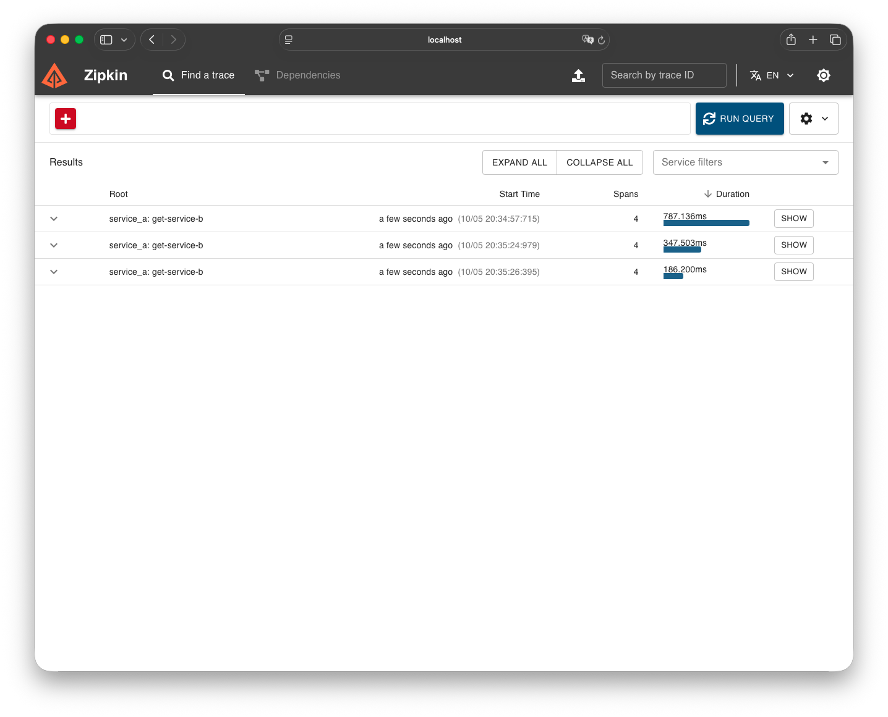
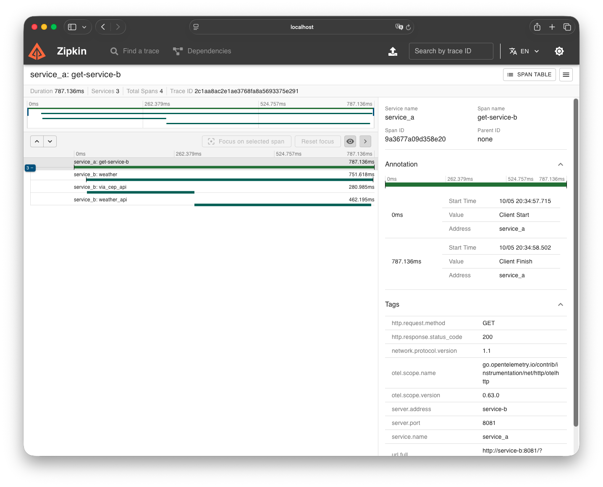
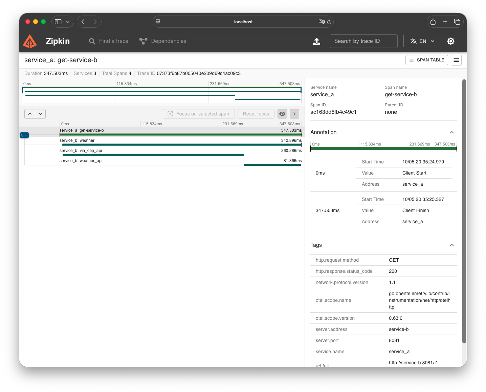
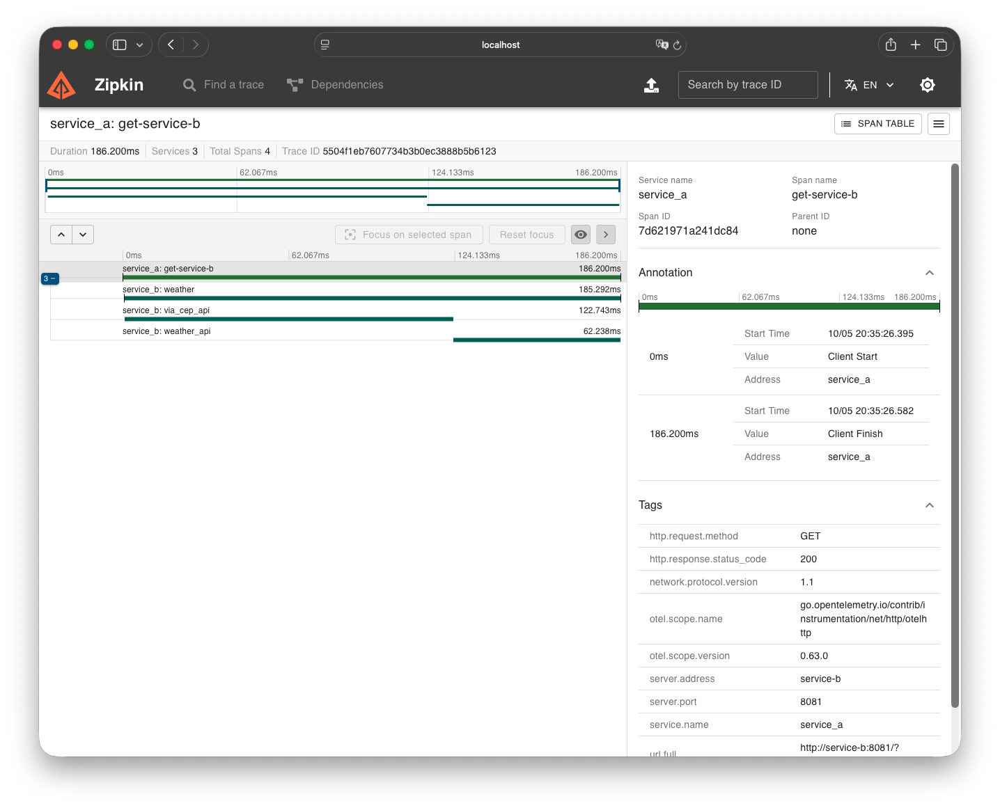

## Lab - Observabilidade & Open Telemetry

**Objetivo:** Desenvolver um sistema em Go que receba um CEP, identifica a cidade e retorna o clima atual (temperatura em graus celsius, fahrenheit e kelvin) juntamente com a cidade. Esse sistema deverá implementar OTEL(Open Telemetry) e Zipkin.

Basedo no cenário conhecido *"Sistema de temperatura por CEP"* denominado Serviço B, será incluso um novo projeto, denominado **Serviço A**.
 
**Requisitos - Serviço A (responsável pelo input):**
- O sistema deve receber um input de 8 dígitos via POST, através do schema:  { "cep": "29902555" }
- O sistema deve validar se o input é valido (contem 8 dígitos) e é uma STRING
  - Caso seja válido, será encaminhado para o **Serviço B** via HTTP
  - Caso não seja válido, deve retornar:
    - Código HTTP: **422**
    - Mensagem: **invalid zipcode**

**Requisitos - Serviço B (responsável pela orquestração):**
- O sistema deve receber um CEP válido de 8 digitos
- O sistema deve realizar a pesquisa do CEP e encontrar o nome da localização, a partir disso, deverá retornar as temperaturas e formata-lás em: Celsius, Fahrenheit, Kelvin juntamente com o nome da localização.
- O sistema deve responder adequadamente nos seguintes cenários:
  - Em caso de sucesso:
    - Código HTTP: **200**
    - Response Body: { "city: "São Paulo", "temp_C": 28.5, "temp_F": 28.5, "temp_K": 28.5 }
  - Em caso de falha, caso o CEP não seja válido (com formato correto):
    - Código HTTP: **422**
    - Mensagem: **invalid zipcode**
  - ​​​Em caso de falha, caso o CEP não seja encontrado:
    - Código HTTP: **404**
    - Mensagem: **can not find zipcode**

Após a implementação dos serviços, adicione a implementação do OTEL + Zipkin:
- Implementar tracing distribuído entre Serviço A - Serviço B
- Utilizar span para medir o tempo de resposta do serviço de busca de CEP e busca de temperatura

**Dicas:**
- Utilize a API viaCEP (ou similar) para encontrar a localização que deseja consultar a temperatura: https://viacep.com.br/
- Utilize a API WeatherAPI (ou similar) para consultar as temperaturas desejadas: https://www.weatherapi.com/
- Para realizar a conversão de Celsius para Fahrenheit, utilize a seguinte fórmula: F = C * 1,8 + 32
- Para realizar a conversão de Celsius para Kelvin, utilize a seguinte fórmula: K = C + 273
  - Sendo F = Fahrenheit
  - Sendo C = Celsius
  - Sendo K = Kelvin
- Para dúvidas da implementação do OTEL, você pode [clicar aqui](https://opentelemetry.io/docs/languages/go/getting-started/)
- Para implementação de spans, você pode [clicar aqui](https://opentelemetry.io/docs/languages/go/instrumentation/#creating-spans)
- Você precisará utilizar um serviço de [collector do OTEL](https://opentelemetry.io/docs/collector/quick-start/)
- Para mais informações sobre Zipkin, você pode [clicar aqui](https://zipkin.io/)

**Entrega:**
- O código-fonte completo da implementação.
- Documentação explicando como rodar o projeto em ambiente dev.
- Utilize docker/docker-compose para que possamos realizar os testes de sua aplicação.

## Execução no ambiente de desenvolvimento

### Compilação e execução

Primeiramente, altere a variável de ambiente `WEATHER_API_KEY` que é a chave de acesso da API de previsão de tempo, que está no arquivo docker-compose.yml. Após a alteração da variável, siga os passos abaixo parta compilar e iniciar a aplicação.

Para compilação e execução local, execute os comandos:

```sh
$ docker-compose build && docker-compose up -d
```

### Forma de utilizar

Para validação da aplicação e visualização do tracer do Open Telemetry no Zipkin, acesse o arquivo `service_a/tests/service_a.http` e execute a chamada da API. Em seguida, acesse o Zipkin e visualize o trace.

## Zipkin

Para acessar o Zipkin, entre no link: http://localhost:9411.









